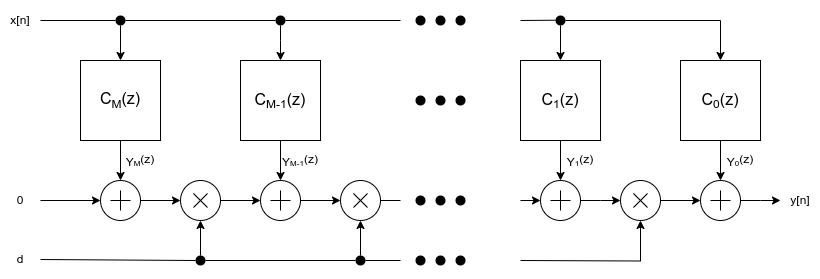

# Farrow Filter Coefficients Estimation Methods

- [Farrow Filter Coefficients Estimation Methods](#farrow-filter-coefficients-estimation-methods)
  - [1. Theory of Variable Fractional Delay Filters](#1-theory-of-variable-fractional-delay-filters)
  - [2. Farrow Filter Structure](#2-farrow-filter-structure)
    - [Obtaining the Farrow Structure using Horner's Rule](#obtaining-the-farrow-structure-using-horners-rule)
  - [3. Lagrange Method for Farrow Filter Coefficients](#3-lagrange-method-for-farrow-filter-coefficients)
    - [Principle of Lagrange Interpolation](#principle-of-lagrange-interpolation)
    - [Applying to Farrow Filter Coefficients (using Vandermonde Matrix)](#applying-to-farrow-filter-coefficients-using-vandermonde-matrix)
    - [Closed-form Derivation of Farrow Filter Coefficients Using the Lagrange Method](#closed-form-derivation-of-farrow-filter-coefficients-using-the-lagrange-method)
    - [Post-processing](#post-processing)
    - [Advantages and Disadvantages](#advantages-and-disadvantages)
  - [4. Weighted Least Squares (WLS) Algorithm for Farrow Filter Coefficients](#4-weighted-least-squares-wls-algorithm-for-farrow-filter-coefficients)
  - [References](#references)

## 1. Theory of Variable Fractional Delay Filters

A **variable fractional delay (VFD) filter** constitutes an indispensable component within contemporary digital signal processing systems.
Its primary function involves precisely delaying a digital signal by a non-integer number of samples, a capability of paramount importance for a diverse array of applications.
These include, but are not limited to, high-fidelity sample rate conversion (necessitating resampling at arbitrary rates), robust synchronization in advanced communication architectures, meticulous alignment of audio signals, and effective echo cancellation in telecommunications.
The inherent capacity to finely adjust delay, frequently in a dynamic manner, confers substantial flexibility when compared to systems reliant solely upon fixed integer delays.

The conceptual foundation for VFD filters is rooted in the ideal fractional delay filter. In the frequency domain, its transfer function perfectly implements a linear phase shift directly corresponding to the desired delay $d$:

$$
H_{ideal}(e^{j\omega}) = e^{-j\omega d}
$$

where $\omega$ denotes the normalized angular frequency.
This straightforward exponential form in the frequency domain translates into a continuous-time sinc function, precisely shifted by $d$, within the time domain:

$$
h_{ideal}[n, d] = \frac{\sin(\pi (n-d))}{\pi (n-d)}
$$

However, this ideal impulse response, characterized by its infinite duration and non-causal nature (extending indefinitely in both positive and negative time), is fundamentally unrealizable in practical, finite-length digital filters.
Consequently, any practical VFD filter design must incorporate approximation techniques, typically involving truncation and/or windowing, to achieve a finite impulse response (FIR) filter realization.

The Z-transform of a practical, causal FIR approximation, spanning a length of $N+1$ samples (from $n=0$ to $N$), distinctly underscores a critical design challenge:

$$
H(z, d) = \sum_{n=0}^{N} h_{approx}[n, d] z^{-n}
$$

This equation explicitly demonstrates that the filter coefficients, $h_{approx}[n, d]$, are inherently dependent upon the desired delay parameter $d$.
A simplistic or direct implementation would thus necessitate the recalculation and loading of an entirely new set of filter coefficients for every incremental change in $d$.
Such an approach would be computationally prohibitive and largely impractical for real-time systems that demand dynamic delay adjustments.

The Farrow filter structure was ingeniously devised to surmount this specific limitation by formulating the filter coefficients as a polynomial function of $d$, thereby enabling efficient and continuous adjustment of the delay.

## 2. Farrow Filter Structure

The Farrow filter represents an exceptionally efficient and adaptable framework for the implementation of variable fractional delay filters. Its fundamental innovation resides in expressing the filter's impulse response, $h[n, d]$, not as a static set of values, but rather as a polynomial in the fractional delay parameter, $d$. This polynomial representation is formally presented as:

$$
h[n, d] = \sum_{m=0}^{M} c_m[n] \cdot d^m
$$

In this formulation, $M$ is the order of the polynomial and $d$ is the fractional delay value, typically normalized with respect to the sampling period to lie within the range $0 \le d < 1$ or $-0.5 \le d < 0.5$.
The intervals can be represented in seconds multiplying by the sampling period obtaining $0 \le \tau < T_s$ or $-T_s/2 \le \tau < T_s/2$ where $\tau=d \cdot T_s$.

Crucially, the terms $c_m[n]$ constitute the fixed impulse responses of $M+1$ distinct **sub-filters**.
Each of these $C_m(z)$ sub-filters functions as a conventional FIR filter, possessing constant coefficients that are independent of $d$.
This strategic segregation of the delay-dependent component ($d^m$) from the immutable filter coefficients ($c_m[n]$) is precisely what confers upon the Farrow structure its considerable operational advantage.

### Obtaining the Farrow Structure using Horner's Rule

To elucidate how this polynomial representation translates into an efficient hardware or software architecture, one may consider the Z-transform of the Farrow filter's overall transfer function:

$$
H(z, d) = \sum_{n} h[n, d] z^{-n} = \sum_{n} \left( \sum_{m=0}^{M} c_m[n] d^m \right) z^{-n}
$$

By judiciously interchanging the order of summation, terms can be grouped by powers of $d$:

$$
H(z, d) = \sum_{m=0}^{M} \left( \sum_{n} c_m[n] z^{-n} \right) d^m
$$

Let $C_m(z)$ denote the transfer function of the $m$-th sub-filter, where $C_m(z) = \sum_{n} c_m[n] z^{-n}$. Substituting this definition into the equation yields the polynomial form for the overall transfer function:

$$
H(z, d) = \sum_{m=0}^{M} C_m(z) d^m
$$

This polynomial in $d$ can be evaluated with remarkable computational efficiency through the application of **Horner's Rule (also recognized as Horner's method or nested multiplication)**.
Horner's rule is a well-established algorithm for polynomial evaluation that effectively minimizes the total requisite number of multiplications. For a polynomial $P(x) = a_0 + a_1 x + a_2 x^2 + \dots + a_M x^M$, it is rewritten as:

$$
P(x) = a_0 + x(a_1 + x(a_2 + \dots + x(a_M)\dots))
$$

Applying Horner's rule to $H(z, d)$, with $x=d$ and $a_m = C_m(z)$, results in the nested form that directly delineates the Farrow filter's architectural blueprint:

$$
H(z, d) = C_0(z) + d(C_1(z) + d(C_2(z) + \dots + d(C_M(z))\dots))
$$

The structure of the Farrow filter is shown as follows:

|  | 
|:--:| 
| *Figure 1. Farrow Filter structure* |

The structure reveals the characteristic configuration of a Farrow filter:

1. The input signal $X(z)$ is concurrently propagated through each of the $M+1$ parallel sub-filters, $C_0(z), C_1(z), \ldots, C_M(z)$. Each individual sub-filter processes the input independently, yielding an intermediate output $Y_m(z) = C_m(z) X(z)$.

2. Subsequently, these intermediate outputs are combined in a sequential, nested manner. Commencing from the innermost term, $Y_M(z)$ is multiplied by $d$ and then summed with $Y_{M-1}(z)$. The resultant value is then multiplied by $d$ and added to $Y_{M-2}(z)$, and this iterative process continues until $Y_0(z)$ is incorporated at the final summation stage. This comprehensive combining stage dynamically adapts to the fractional delay $d$, executing $M$ multiplications by $d$ and $M$ additions. The distinct advantage of this approach lies in the fact that the fixed coefficients are confined solely to the $C_m(z)$ sub-filters, while the variable delay is applied through straightforward scalar multiplications and summations.

## 3. Lagrange Method for Farrow Filter Coefficients

The Lagrange method offers a robust and direct methodology for deriving the coefficients $c_m[n]$ of the Farrow sub-filters. Its operational principle is predicated upon the requirement that the composite Farrow filter's impulse response $h[n,d]$ must precisely coincide with the ideal impulse response $h_{ideal}[n,d]$ at a selected set of $M+1$ pre-defined integer delay values, commonly referred to as interpolation points.

### Principle of Lagrange Interpolation

Lagrange interpolation represents a classical numerical technique. Given a set of $M+1$ distinct data points $(x_0, y_0), (x_1, y_1), \ldots, (x_M, y_M)$, there demonstrably exists a unique polynomial of a degree at most $M$ that meticulously traverses all these points. The Lagrange interpolation polynomial $L(x)$ is formally expressed as a summation of scaled basis polynomials:

$$
L(x) = \sum_{k=0}^{M} y_k \cdot L_k(x)
$$

where $L_k(x)$ denote the Lagrange basis polynomials, each specifically defined such that $L_k(x_k)=1$ and $L_k(x_j)=0$ for all $j \neq k$:

$$
L_k(x) = \prod_{j=0, j \neq k}^{M} \frac{x - x_j}{x_k - x_j}
$$

Within the operational context of Farrow filters, this fundamental principle is employed to interpolate the ideal impulse response $h_{ideal}[n,d]$ as a function of the delay parameter $d$.

### Applying to Farrow Filter Coefficients (using Vandermonde Matrix)

For a particular filter tap $n$ (i.e., for a fixed sample index), the Farrow filter's impulse response $h[n,d]$ is articulated as a polynomial in $d$:

$$
h[n, d] = c_0[n] + c_1[n]d + c_2[n]d^2 + \dots + c_M[n]d^M
$$

To ascertain the coefficients $c_m[n]$, it is mandated that this polynomial must precisely align with the ideal impulse response $h_{ideal}[n,d]$ at $M+1$ judiciously chosen integer interpolation points, which shall be designated as $d_0, d_1, \ldots, d_M$. Conventional selections for these points often include evenly spaced integers, such as $d_j = j$ for $j=0, \ldots, M$, or a symmetrically arranged set like $d_j = j - \lfloor M/2 \rfloor$. For purposes of simplified demonstration, let us assume $d_j = j$.

This stipulated requirement culminates in a system of $M+1$ linear equations for the $M+1$ unknown coefficients $c_m[n]$ (for a *fixed* tap $n$):

$$
c_0[n] + c_1[n]d_j + c_2[n]d_j^2 + \dots + c_M[n]d_j^M = h_{ideal}[n, d_j] \quad \text{for } j=0, 1, \ldots, M
$$

This system can be elegantly cast into matrix form:

$$
\mathbf{V} \mathbf{c}[n] = \mathbf{h}_{ideal}[n]
$$

Each constituent component is defined as follows:

- $\mathbf{c}[n]$ represents the column vector containing the unknown sub-filter coefficients pertinent to the current tap $n$:
  $$
  \mathbf{c}[n] = \begin{bmatrix} c_0[n] \\ c_1[n] \\ \vdots \\ c_M[n] \end{bmatrix}
  $$

- $\mathbf{h}_{ideal}[n]$ is the column vector comprised of the ideal impulse responses evaluated at the selected interpolation points for tap $n$:
  $$
  \mathbf{h}_{ideal}[n] = \begin{bmatrix} h_{ideal}[n, d_0] \\ h_{ideal}[n, d_1] \\ \vdots \\ h_{ideal}[n, d_M] \end{bmatrix}
  $$

- $\mathbf{V}$ is the pivotal **Vandermonde matrix**, whose elements are powers of the interpolation points $d_j$:
  $$
  \mathbf{V} = \begin{bmatrix}
  1 & d_0 & d_0^2 & \dots & d_0^M \\
  1 & d_1 & d_1^2 & \dots & d_1^M \\
  \vdots & \vdots & \vdots & \ddots & \vdots \\
  1 & d_M & d_M^2 & \dots & d_M^M
  \end{bmatrix}
  $$

A fundamental characteristic of the Vandermonde matrix is its invertibility if and only if all the interpolation points $d_j$ are distinct, a condition which is inherently satisfied within this context.
Consequently, the vector of sub-filter coefficients $\mathbf{c}[n]$ can be uniquely determined by solving this linear system:
$$
\mathbf{c}[n] = \mathbf{V}^{-1} \mathbf{h}_{ideal}[n]
$$

This computation is executed iteratively for each individual filter tap $n$ across the entire desired length of the Farrow filter. Once calculated for all relevant $n$ and $m$, these derived $c_m[n]$ coefficients precisely constitute the impulse responses of the $M+1$ distinct FIR sub-filters $C_m(z)$.

### Closed-form Derivation of Farrow Filter Coefficients Using the Lagrange Method

A closed-form can be derived considering:
- the interpolation points $d_j = j$
- the ideal impulse response as $h_{ideal}[n]=z^{-d}$

Moreover, as suggested in the literature, a transformation matrix $\mathbf{T}$ must be applied.

The ideal input-output relation in the Z domain is $Y(z)=z^{-d}X(z)$ for $d=0,1,\dots,M$, and considering the transfer function $H(z, d) = \sum_{m=0}^{M} C_m(z) d^m$, we can write the relation between the $Y(z)$ and $H(z,d)$ substituting the variable $d$ with the values $0,1,\dots,M$:

$$
\mathbf{V} \mathbf{C} = \mathbf{z}
$$

where

- the Vandermonde matrix becomes:
  $$
  \mathbf{V} = 
  \begin{bmatrix}
    1 & 0 & 0 & \dots & 0 \\
    1 & 2 & 1 & \dots & 1 \\
    \vdots & \vdots & \vdots & \ddots & \vdots \\
    1 & M & M^2 & \dots & M^M
  \end{bmatrix}
  $$
- $\mathbf{C}$ is a vector that contains the transfer functions of the subfilters of the Farrow filter:
  $$
  \mathbf{C}=[C_0(z), C_1(z), \dots, C_{M-1}(z)]^T
  $$
- $\mathbf{z}$ is the delay vector:
  $$
  \mathbf{z} = [1, z^{-1}, z^{-2}, \dots, z^{-M}]^T
  $$

The solution of the system can be calculated inverting the Vandermonde matrix:

$$
\mathbf{C} = 
\begin{bmatrix}
  C_0(z) \\
  C_1(z) \\
  \vdots \\
  C_{M} (z)
\end{bmatrix} =
\mathbf{V}^{-1} \mathbf{z}
$$

Finally, as suggested in the literature, a transformation matrix $\mathbf{T}$ must be applied. 

$$
T_{n,m} = 
\begin{cases}
  \big \lfloor M/2 \big \rfloor^{n} \binom{n}{m}, & \mathrm{for\;} n\ge m  \\
  0 & \mathrm{for\;} n<m
\end{cases}
$$

The vector of the transfer functions of the subfilters will be:

$$
\mathbf{C} = 
\mathbf{c} \; \mathbf{z} = 
\mathbf{T} \; \mathbf{V}^{-1} \; \mathbf{z}
\implies
\mathbf{c}= 
\mathbf{T} \; \mathbf{V}^{-1}
$$

where

$$
\mathbf{c} = 
\begin{bmatrix}
  c_0[0] & c_0[1] & \dots  & c_0[M] \\
  c_1[0] & c_1[1] & \dots  & c_1[M] \\
  c_2[0] & c_2[1] & \dots  & c_2[M] \\
  \vdots & \vdots & \vdots & \vdots \\
  c_M[0] & c_M[1] & \dots  & c_M[M]
\end{bmatrix}
$$

For $M=2$ and applying $\mathbf{T}$, the coefficients of the subfilters are:

$$
\begin{align}
  \mathbf{c} = &
  \mathbf{T} \; \mathbf{V}^{-1}
  = \\ & 
  \begin{bmatrix}
    1 & 1 & 1 \\
    0 & 1 & 2 \\
    0 & 0 & 1 \\
  \end{bmatrix}
  \begin{bmatrix}
    1     & 0   & 0     \\
    -3/2  & 2   & -1/2  \\
    1/2   & -1  & 1/2   \\
  \end{bmatrix}
  = \\ &
  \begin{bmatrix}
    0     & 1   & 0     \\
    -1/2  & 0   & 1/2  \\
    1/2   & -1  & 1/2   \\
  \end{bmatrix}
\end{align}
$$

Note that by applying the transformation matrix, the delay interval is $0 \leq d < 1$ for M odd or $-0.5 \leq d < 0.5$ for M even.

### Post-processing

Following the computation of the raw $c_m[n]$ coefficients, a critically important post-processing stage typically entails their multiplication by a meticulously selected **window function** (e.g., Hamming, Blackman, or Kaiser windows). This procedure serves to truncate the theoretically infinite impulse response of the ideal filter, thereby ensuring the practical realization of a finite-length, causal filter. Furthermore, windowing plays a pivotal role in shaping the filter's frequency response, primarily by mitigating undesirable ripple phenomena in both the passband and stopband, albeit often at the expense of a marginally broader transition band.

### Advantages and Disadvantages

**Advantages:**

* **Direct and Analytical Solution:** The Lagrange method furnishes a straightforward, closed-form mathematical expression for the derivation of the sub-filter coefficients. This inherent analytical nature proves advantageous for both theoretical comprehension and practical implementation.

* **Exact Interpolation:** A notable strength of this approach is that the Farrow filter's frequency and impulse responses will exhibit perfect congruence with the ideal response precisely at the predetermined interpolation points. This exactitude can be of critical importance in applications where performance at specific delay values is paramount.

* **Conceptual Simplicity:** The fundamental principle underpinning this method is rooted in standard polynomial interpolation techniques, rendering it conceptually accessible to individuals conversant with numerical methodologies.

**Disadvantages:**

* **Performance Degradation between Interpolation Points:** While maintaining exactness at the chosen $M+1$ points, the accuracy of the approximation can markedly diminish for fractional delay values that fall between these interpolation points. This represents an intrinsic limitation of polynomial interpolation.

* **Computational Burden (Vandermonde):** For elevated orders of $M$, the computation of the inverse of the Vandermonde matrix can become numerically unstable and computationally intensive. Although typical Farrow filter orders ($M$) are generally modest, this factor warrants consideration for applications demanding exceptionally high precision.

* **Sub-optimality in Frequency Domain:** The Lagrange method primarily optimizes the approximation within the time domain (by fitting the impulse response). It does not explicitly optimize the filter's performance characteristics in the frequency domain (e.g., minimizing ripple or maximizing stopband attenuation), which may represent a more critical performance metric for a multitude of digital signal processing applications.

## 4. Weighted Least Squares (WLS) Algorithm for Farrow Filter Coefficients

As explained above, the transfer function of a VFD is an approximation of the ideal transfer function $H_{ideal}(e^{j\omega}) = e^{-j\omega d}$ which can be implemented using a Farrow filter whose coefficients are evaluated using methods such as Lagrange interpolation.

The choice of method depends on the performance expressed in terms of amplitude and phase distortions, and the Lagrange method does not exhibit low distortions for wideband signals. One solution is to use other methods, such as weighted least squares, which can produce more satisfactory designs with lower filter orders than the Lagrange interpolator.

In this report, two works are considered:

- Deng, Tian-Bo. "Symmetry-based low-complexity variable fractional-delay FIR filters." *IEEE International Symposium on Communications and Information Technology, 2004. ISCIT 2004*. Vol. 1. IEEE, 2004.
- Deng, Tian-Bo. "Weighted-least-squares design of odd-order variable fractional-delay filters using coefficient-symmetry." *2007 6th International Conference on Information, Communications & Signal Processing. IEEE, 2007*.

Author Deng Tian-Bo explains how to use the WLS algorithm to estimate the subfilter coefficients of the Farrow filter and develop a method to obtain the symmetry of the subfilter coefficients. In this way, the computational complexity is reduced compared to a traditional WLS method.

The theory is not reported in this document because it's not easy such as the Lagrange interpolation, but you can find the functions to generates the coefficients of the Farrow filters. Note that the coefficients of a single FIR filter can be symmetric or antisymmetric.

## References

- [Discrete-Time Modeling of Acoustic Tubes Using Fractional Delay Filters](http://users.spa.aalto.fi/vpv/publications/vesa_phd.html) (Thesis for the degree of Doctor of Technology)

- [Digital Signal Processing with FPGAs - Farrow Filters](https://www.dsprelated.com/freebooks/sasp/Farrow_Filter.html)

- [Symmetry-based low-complexity variable fractional-delay FIR filters](https://ieeexplore.ieee.org/document/1412478)

- [Weighted-least-squares design of odd-order variable fractional-delay filters using coefficient-symmetry](https://ieeexplore.ieee.org/document/4449559)

